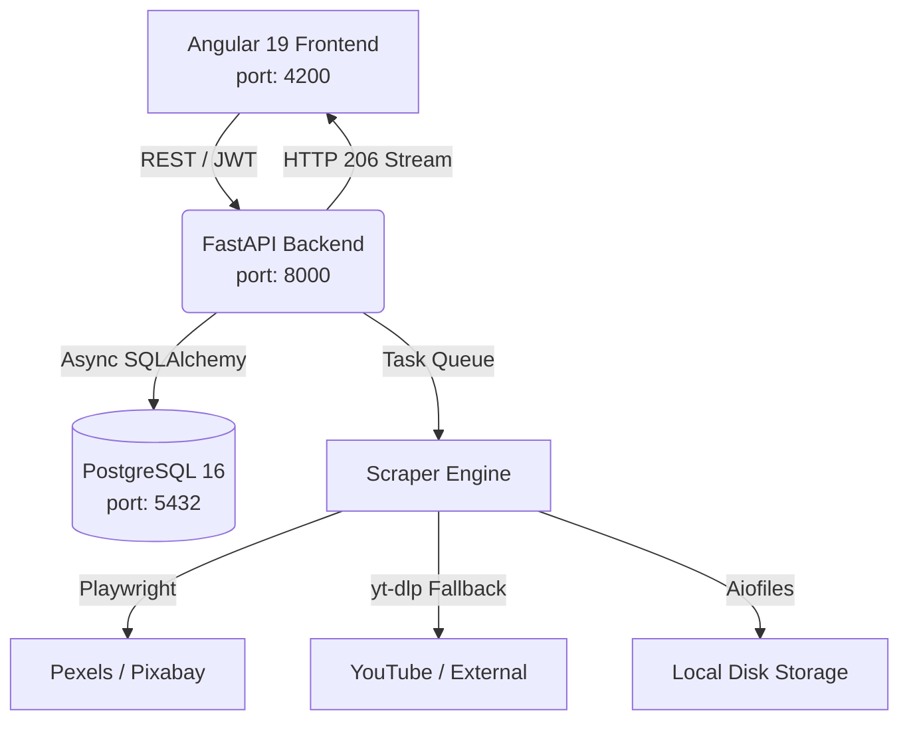

# Mr. Scrapper 🎬

**Automated Video Database Builder for Dark Channels**

Mr. Scrapper is a powerful, fully-dockerized full-stack application designed to autonomously scrape, download, organize, and stream AI-generated & royalty-free short videos. It acts as a continuous media acquisition engine to fuel dark channels and content creators.


## ✨ Key Features

- **🛡️ Anti-Bot Bypass:** Utilizes headless Chromium via **Playwright** to navigate platforms like Pexels and Pixabay, bypassing Cloudflare 403 blocks.
- **🔄 Smart Fallback Engine:** If primary sources fail or return no results, it seamlessly falls back to searching Google and YouTube using **yt-dlp**, extracting copyright-free videos.
- **🚦 Task Queueing:** Insert multiple search queries at once. The system queues them and processes downloads in the background autonomously.
- **📽️ YouTube-like UI:** Features a modern Angular 19 frontend with hover video previews, dynamic thumbnails, and seamless chronological autoplay.
- **🔐 Built-in Authentication:** JWT-based secure login, with an automatic default testing account created on startup.
- **🐳 100% Dockerized:** Run the Database, Backend API, and Frontend web application instantly with a single command.

---

## 🚀 Quick Start

### 1. Requirements
- Docker and Docker Compose installed on your system.

### 2. Setup Configuration
Copy the example environment file and adjust if necessary (SMTP, Database passwords, etc.):
```bash
cp .env.example .env
```

### 3. Build and Run
Start the entire infrastructure detached:
```bash
docker-compose up -d --build
```
> **Note:** The first build takes a few minutes as it downloads Playwright browser binaries and sets up the Angular production build.

### 4. Access the Application
- **Frontend Dashboard:** [http://localhost:4200](http://localhost:4200)
- **Backend API Docs (Swagger):** [http://localhost:8000/docs](http://localhost:8000/docs)

**Default Login:**
- **Email:** `teste@email.com`
- **Password:** `admin`

---

## 🏗️ Architecture



---

## 🛠️ Technology Stack

### Backend
- **Core:** Python 3.12, FastAPI
- **Database:** PostgreSQL 16, SQLAlchemy 2.0 (Async), Alembic
- **Scraping:** Playwright (Chromium), yt-dlp, BeautifulSoup4, httpx
- **Auth:** Passlib (Bcrypt 3.2.2), python-jose (JWT)
- **Streaming:** HTTP 206 Partial Content Range streaming via `aiofiles`

### Frontend
- **Core:** Angular 19 (Standalone Components, Signals)
- **Styling:** Vanilla CSS (Modern, Dark Mode, Glassmorphism)
- **Routing:** Angular Router (Auth Guards)
- **Server:** Nginx (Alpine)

### Infrastructure
- **Containerization:** Docker & Docker Compose
- **Volumes:** Persistent volumes for database and media (videos/thumbnails)

---

## 📡 Core API Endpoints

### Authentication
| Method | Endpoint | Description |
|--------|----------|-------------|
| POST | `/api/auth/register` | Register new user |
| POST | `/api/auth/login` | Login (returns JWT) |
| GET | `/api/auth/confirm/{token}` | Confirm email |

### Media Management
| Method | Endpoint | Description |
|--------|----------|-------------|
| GET | `/api/videos` | List videos (paginated) |
| GET | `/api/videos/{id}` | Video metadata details |
| GET | `/api/videos/{id}/stream` | Stream video (HTTP 206 Range) |
| GET | `/api/videos/{id}/download` | Download raw `.mp4` file |
| GET | `/api/videos/{id}/thumb` | Serve thumbnail image |
| GET | `/api/videos/{id}/next` | Auto-play chronological lookup |
| PUT | `/api/videos/{id}` | Update metadata (Title/Tags) |
| DELETE | `/api/videos/{id}` | Delete video from DB & Disk |

### Scraper Engine
| Method | Endpoint | Description |
|--------|----------|-------------|
| POST | `/api/scraper/start` | Start scraping task or add to Queue |
| GET | `/api/scraper/status` | Current task status and Queue list |
| DELETE | `/api/scraper/queue/{id}` | Remove a task from the Queue |
| POST | `/api/scraper/stop` | Stop running task and wipe Queue |

---

## 📝 License

Private — All rights reserved. Do not distribute.
# mr-scrapper
# mr-scrapper
